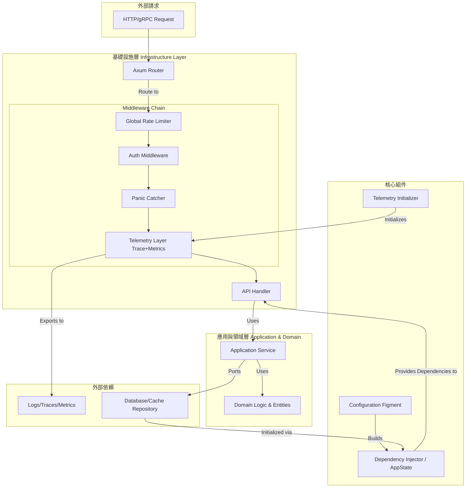

# **設計文檔 D01: Rust 服務模板架構 v1.2**

**文檔版本**: 1.2
**狀態**: 已批准 (Approved)
**作者**: AI Architect, Community Reviewer
**最後更新**: 2025-06-21
**變更日誌**:

- **v1.2**: 整合資深專家評審意見。**重構錯誤處理**，引入結構化錯誤與領域/基礎設施錯誤分離；**增加配置驗證**；**引入依賴注入 (DI)** 模式；**強化安全基線**（安全標頭、中間件順序分析）；擴充測試策略（契約、負載測試）；**明確風險與未來路線圖**。更新架構圖以反映中間件鏈路。
- **v1.1**: 初始架構設計。

---

## **1. 願景與目標 (Vision & Goals)**

### 1.1. 問題陳述

在微服務架構中，如果沒有統一的標準，每個新服務的開發都會面臨重複的基礎設施工作，如日誌、監控、配置、錯誤處理等。這不僅降低了開發效率，更導致了各服務實現不一、可觀測性參差不齊、維護成本高昂等問題。

### 1.2. 設計目標

本設計旨在創建一個標準化的 **Rust 服務模板**，為所有微服務提供一個堅實、一致的基礎。其核心目標是：

- **開發效率 (Developer Velocity)**: 開發者可以基於模板快速創建新服務，專注於業務邏輯而非基礎設施。
- **默認可觀測性 (Observability by Default)**: 所有服務從誕生之初就具備結構化日誌、分佈式追踪和核心指標的能力。
- **穩健性與一致性 (Robustness & Consistency)**: 提供統一的錯誤處理、Panic 捕獲和優雅關閉機制，確保服務行為一致且可預測。
- **生產級就緒 (Production Ready)**: 內置 CI/CD 流程、雲原生運維端點和安全考量，縮短從開發到部署的距離。
- **長期可維護性 (Long-term Maintainability)**: 採用分層架構與依賴注入，促進關注點分離，使複雜業務的長期演進更加清晰。

---

## **2. 核心原則 (Core Principles)**

- **約定優於配置 (Convention over Configuration)**: 提供一套合理的默認配置，讓開發者開箱即用。
- **結構化與可操作日誌 (Structured & Actionable Logs)**: 所有日誌輸出為 JSON 格式，並自動注入上下文信息（如 `trace_id`），便於機器解析和問題定位。
- **優雅降級與關閉 (Graceful Degradation & Shutdown)**: 當依賴不可用時，服務應能正常運行；當收到終止信號時，應能優雅關閉。
- **默認安全與韌性 (Secure & Resilient by Default)**: 內置可配置的限流策略、基礎安全標頭，並提供清晰的外部依賴處理與認證集成模式。
- **性能感知 (Performance Aware)**: 採用非阻塞日誌和高性能庫，確保基礎設施開銷最小化。
- **分層與可測試架構 (Layered & Testable Architecture)**: 鼓勵業務邏輯與基礎設施分離，提高代碼的可測試性和可維護性。

---

## **3. 整體架構 (Overall Architecture)**

服務的核心圍繞 Axum 框架，並通過中間件（Layers）將橫切關注點無縫集成。架構在外部接口、應用核心和外部系統之間實現了清晰的隔離，並採用依賴注入模式管理服務依賴。



---

## **4. 組件詳細設計 (Component Design)**

### **4.1. 日誌: `tracing`**

- **核心庫**: `tracing`, `tracing-subscriber`, `tracing-appender`
- **模塊**: `src/telemetry.rs`
- **設計要點**:
  1.  **非阻塞日誌**: 生產環境使用 `tracing_appender` 將 I/O 寫入與請求處理線程解耦。確保在優雅關閉時刷寫緩存，避免日誌丟失。
  2.  **結構化日誌 (JSON)**: 生產環境使用 `tracing_subscriber::fmt().json()` 輸出 JSON 格式日誌。
  3.  **開發環境友好**: 開發環境使用美化、著色的控制台輸出。
  4.  **配置驅動**: 日誌格式 (`json`/`text`) 和級別由配置管理。

### **4.2. 遙測: OpenTelemetry**

- **核心庫**: `opentelemetry v0.29+`, `opentelemetry_sdk`, `tracing-opentelemetry`, `opentelemetry-otlp`, `opentelemetry-prometheus-exporter-bridge`
- **模塊**: `src/telemetry.rs`
- **設計要點**:
  1.  **版本策略**: 持續跟進 OTel Rust SIG 的穩定版本（1.x），預留升級路徑。
  2.  **分佈式追踪**: 使用 `opentelemetry-otlp` 導出追踪數據。
  3.  **指標 (Metrics)**: 使用 `opentelemetry-prometheus-exporter-bridge` 將 OTel Metrics API 轉換為 Prometheus 可抓取的格式。

### **4.3. 錯誤處理 (強化)**

- **核心模式**: 分層錯誤類型 + `thiserror` + Axum 的 `IntoResponse` trait。
- **模塊**: `src/error.rs`
- **設計要點**:
  1.  **分層錯誤**:
      - `DomainError`: 定義在領域層，代表業務規則的失敗（如“用戶餘額不足”）。
      - `InfrastructureError`: 定義在基礎設施層，代表外部依賴的錯誤（如數據庫連接失敗）。
      - `AppError`: 位於應用層頂部，包裝所有下層錯誤，並提供給 Web 框架。
  2.  **結構化與上下文**: 使用 `thiserror` 為錯誤添加豐富的上下文，便於診斷。
  3.  **無縫轉換**: 為 `AppError` 實現 `From<T>`，以便用 `?` 操作符在各層之間傳遞和轉換錯誤。
  4.  **標準化響應**: `AppError` 的 `IntoResponse` 實現將每個錯誤變體映射到合適的 HTTP 狀態碼和標準化的 JSON 響應體。

```rust
// src/error.rs
#[derive(Debug, thiserror::Error)]
pub enum AppError {
    #[error("Validation Error: {0}")]
    Validation(String),

    #[error("Unauthorized: {0}")]
    Unauthorized(String),

    #[error("Resource not found: {resource}")]
    NotFound { resource: String },

    #[error("An internal error occurred.")]
    Infrastructure(#[from] InfrastructureError),

    #[error("A business rule was violated.")]
    Domain(#[from] DomainError),
}

// 示例：基礎設施錯誤
#[derive(Debug, thiserror::Error)]
pub enum InfrastructureError {
    #[error("Database error: {0}")]
    Database(#[from] sqlx::Error),
    #[error("External service unavailable: {service}")]
    ExternalService { service: String },
}

// ... 為 AppError 實現 IntoResponse
```

### **4.4. Panic 處理與優雅關閉**

- **核心庫**: `std::panic`, `tokio::signal`, `tracing`
- **模塊**: `src/telemetry.rs`, `src/main.rs`
- **設計要點**:
  1.  **全局 Panic Hook**: 通過 `std::panic::set_hook` 捕獲未處理的 Panic，記錄詳細信息後終止進程。
  2.  **安全的異步任務**: 提供 `telemetry::spawn_instrumented` 輔助函數，確保 `tokio::spawn` 內的 Panic 被捕獲和記錄。
  3.  **優雅關閉 (Graceful Shutdown)**: 監聽 `SIGINT`/`SIGTERM`，觸發後停止接收新請求，等待現有請求處理完成，刷寫遙測數據，然後平穩退出。

### **4.5. 內置運維端點與特性 (強化)**

- **模塊**: `src/infrastructure/web/`
- **設計要點**:
  1.  **健康檢查**: 提供 `/healthz/live`, `/healthz/ready` 端點，並在文檔中說明其在 Kubernetes 中的應用。
  2.  **/metrics**: Prometheus 指標端點。
  3.  **/info**: 使用 `vergen` 在編譯時注入 Git commit hash 和構建時間。
  4.  **限流 (Rate Limiting)**:
      - **庫**: `tower_governor`。
      - **水平擴展**: 文檔中明確指出，在多副本部署時，需要為 `tower_governor` 配置外部狀態存儲（如 Redis）以實現全局限流。
  5.  **認證/授權插槽**: 提供一個清晰的 `middleware/auth.rs` 骨架作為擴展點。
  6.  **安全基線 (Security Baseline)**:
      - **安全標頭**: 默認添加安全相關的 HTTP 標頭中間件（如 `X-Content-Type-Options: nosniff`, `X-Frame-Options: DENY`）。
      - **中間件順序**: 文檔中分析並推薦中間件順序。推薦採用混合策略：在最外層設置寬鬆的全局限流器，在認證後為特定用戶或 API 設置更嚴格的限流器。

### **4.6. 組態與密鑰管理 (強化)**

- **核心庫**: `figment`, `dotenvy`, `validator`
- **模塊**: `src/config.rs`
- **設計要點**:
  1.  **分層加載**: 實現三層覆寫策略：默認值 -> 配置文件 (`.toml`) -> 環境變量。
  2.  **配置驗證**:
      - 在 `Config` 結構體上派生 `validator::Validate`。
      - 在服務啟動時調用 `config.validate()`，若驗證失敗則立即終止服務，實現「快速失敗」。
  3.  **密鑰管理**: 文檔強調通過環境變量加載敏感信息。對於生產環境，建議與雲服務（如 AWS Secrets Manager, HashiCorp Vault）集成，並提供相關的集成模式說明。

```rust
// src/config.rs
use validator::Validate;

#[derive(serde::Deserialize, Validate)]
pub struct Config {
    #[validate(range(min = 1024, max = 65535))]
    pub port: u16,
    // ...
}

impl Config {
    pub fn load() -> Result<Self, figment::Error> {
        let config: Config = figment::Figment::new()
            // ... 加載邏輯
            .extract()?;
        config.validate().map_err(|e| ...)?; // 轉換為 figment::Error
        Ok(config)
    }
}
```

---

## **5. 模板結構與擴展性**

### **5.1. 目錄結構 (分層)**

採用受領域驅動設計（DDD）啟發的分層結構，促進關注點分離。

```text
service-template/
├── .github/workflows/ci.yml
├── config/
│   ├── default.toml
│   └── production.toml
├── docs/                      # 詳細設計決策、ADRs
│   └── testing_strategy.md
├── tests/                     # 整合測試
├── Cargo.toml
├── CONTRIBUTING.md            # 協作規範
├── Dockerfile.multistage
└── src/
    ├── domain/                # 領域層: 核心業務邏輯、實體、領域錯誤
    ├── application/           # 應用層: 用例、協調領域與基礎設施
    ├── infrastructure/        # 基礎設施層: Web, DB Client, 基礎設施錯誤
    ├── config.rs              # 配置加載與驗證
    ├── error.rs               # 統一錯誤類型與轉換
    ├── telemetry.rs           # 日誌、追踪、指標初始化
    └── main.rs                # 服務啟動入口
```

### **5.2. 依賴注入與控制反轉 (新增)**

- **模式**: 默認採用 **構造函數注入 (Constructor Injection)**。將依賴（如數據庫連接池）包裝在 `AppState` 結構中，並在創建應用服務實例時傳入。
- **目的**: 解耦應用邏輯與具體實現，極大提升單元測試能力（可輕鬆注入 Mock 對象）。
- **高級選項**: 對於大型複雜應用，文檔中提及可選用 `shaku` 等輕量級 DI 框架。

### **5.3. 測試策略與覆蓋範例 (擴展)**

- **單元測試**: 在各模塊內測試純邏輯，尤其是在 `domain` 層和 `application` 層，利用依賴注入 Mock 外部依賴。
- **集成測試**: 在 `tests/` 目錄下，啟動完整服務實例，測試 API 端點、中間件行為和數據庫交互。
- **推薦的高級測試策略 (文檔化)**:
  - **契約測試 (Contract Testing)**: 推薦使用 Pact 等工具，確保服務間的 API 調用符合約定。
  - **性能/負載測試 (Performance/Load Testing)**: 推薦使用 `k6`, `oha` 或在基準測試中使用 `criterion`。
  - **混沌工程 (Chaos Engineering)**: 建議在成熟階段引入，模擬網絡延遲、依賴故障等場景，驗證服務的韌性。

### **5.4. Feature Gating**

使用 Feature Flags 管理可選的協議或數據庫依賴，保持模板的靈活性。

```toml
[features]
default = ["http", "db-sqlx"]
http    = ["axum", "tower-http", "tower_governor"]
grpc    = ["tonic", "prost"]
db-sqlx = ["sqlx"]
```

---

## **6. CI/CD 與部署**

- **持續整合 (CI)**: GitHub Actions workflow 執行 `cargo check`, `fmt`, `clippy`, `test` 和 `cargo-deny` 安全審計。
- **容器化 (優化)**:
  - **`cargo-chef`**: 在多階段 `Dockerfile` 中使用 `cargo-chef` 緩存依賴編譯層，大幅縮短構建時間。
  - **最小化鏡像**: 最終鏡像基於 `distroless` 或 `alpine`，以最小化體積和攻擊面。
- **部署**: 推薦使用 Helm Chart 進行 Kubernetes 部署。

---

## **7. 開發者體驗與文檔 (Developer Experience & Documentation)**

- **快速啟動**:
  - **`cargo-generate`**: 推薦使用 `cargo generate` 基於此模板創建新項目，自動化初始化過程。
  - **`Makefile`**: 提供一鍵式本地啟動命令（如 `make run-local`）。
- **文檔化**:
  - **API 文檔自動化**: 推薦使用 `utoipa`，通過宏從代碼直接生成 OpenAPI 規格。
  - **`README.md`**: 提供清晰的項目介紹、架構概覽、快速啟動和擴展指南。
  - **`docs/`**: 存放詳細設計決策、架構決策記錄 (ADRs) 和高級主題指南（如測試策略、部署模式）。
  - **`CONTRIBUTING.md`**: 提供代碼提交規範 (如 Conventional Commits)、分支策略和版本管理方法。

---

## **8. 潛在風險與緩解策略 (新增)**

- **技術與依賴風險**:
  - **風險**: OpenTelemetry Rust API 在 1.0 之前可能存在破壞性變更。
  - **緩解**: 密切關注官方版本發布，將 OTel 初始化邏輯高度封裝在 `telemetry.rs` 中，便於未來升級。
- **架構演進風險**:
  - **風險**: 隨著業務複雜化，領域層可能意外地依賴基礎設施層的細節（如 `sqlx::Error`）。
  - **緩解**: 嚴格執行分層錯誤處理和依賴注入。在 Code Review 中對跨層依賴保持警惕。
- **安全與治理風險**:
  - **風險**: 密鑰管理過於簡單，無法滿足企業級安全要求。
  - **緩解**: 模板默認使用環境變量，但文檔中必須提供與 Vault/KMS 等外部密鑰管理系統集成的架構模式和建議。

---

## **9. 推薦的未來路線圖 (新增)**

- **近期 (核心功能完善)**:
  1.  **升級 OTel 1.x**: 待 OTel Rust 1.0 發布後，第一時間跟進並驗證其穩定性。
  2.  **完善 DI 範例**: 提供一個完整的、可運行的基於構造函數注入的 CRUD 範例。
  3.  **補全安全機制範例**: 提供一個完整的 JWT 驗證中間件實現，並演示 `tower_governor` 與 Redis 的集成。
- **中期 (自動化與生態集成)**:
  1.  **建立自動化 Release Flow**: 使用 `cargo-release` 和 GitHub Actions 自動化版本標籤和容器鏡像發布。
  2.  **集成 `utoipa`**: 在模板中默認集成 `utoipa`，實現 API 文檔的自動生成。
- **長期 (平台化與易用性)**:
  1.  **編寫部署指南**: 針對主流雲平台（如 AWS EKS, GKE）撰寫詳細的部署 Quick-Start 指南。
  2.  **探索 gRPC 支持**: fleshing out the `grpc` feature with a full example using `tonic`.
