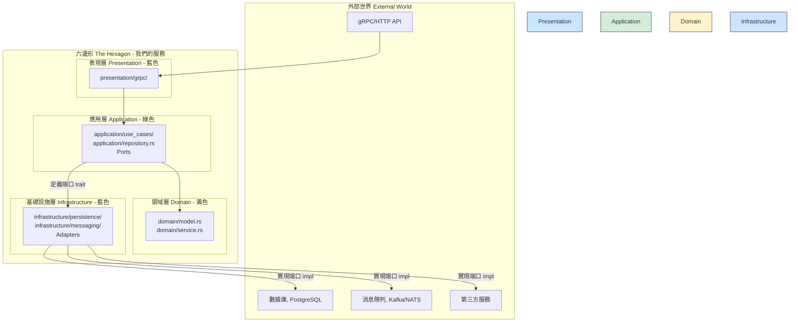

# **技術架構設計文檔 v1.0 (Technical Architecture)**

**文檔版本**: 1.0
**最後更新**: `2025-06-18`

---

## **1 後端架構 (Backend Architecture)**

### **1.1. 微服務設計**

後端採用微服務架構，以實現高內聚、低耦合和獨立擴展。

- **API 網關 (`bff_service`)**:
  - **技術**: **Axum (Rust)**
  - **職責**: 作為所有前端請求的**統一入口**，處理用戶認證 (JWT)、請求校驗、速率限制，並將請求路由到內部服務。
  - **接口**: 向外提供 **GraphQL API** (使用 `async-graphql`)，以滿足前端多樣化的數據獲取需求。
- **用戶認證服務 (`auth_service`)**: 負責處理 Line Login 回調、密碼哈希、JWT 簽發與驗證。
- **合成引擎服務 (`synthesis_engine`)**: 實現無配方合成的核心邏輯，查詢知識圖譜。
- **實體管理服務 (`entity_manager`)**: 管理 ECS 世界的狀態，處理實體的創建、更新、刪除。
- **AI 敘事服務 (`content_ai_service`)**: 封裝與 LLM 的交互，根據遊戲事件生成敘事文本。
- **抽卡服務 (`gacha_service`)**: 處理抽卡邏輯、卡池管理和概率計算。
- **服務間通信**: 統一使用 **gRPC (Tonic)** 進行內部通信，確保高性能和強類型安全。

### **1.2. 異步運行時**

- 所有後端服務均基於 **Tokio** 異步運行時。

---

### **1.3. 微服務內部架構：六邊形架構 (Ports & Adapters)**

為了確保每個微服務的**高內聚、低耦合**，以及長期**可測試、可演進**，我們統一採用**六邊形架構（Ports & Adapters）**作為所有 Rust 後端服務的標準內部架構。

#### **1.3.1. 核心理念與依賴規則**

此架構的核心思想是將**業務邏輯（Domain）**與**外部依賴（Infrastructure）**徹底解耦。其最重要的規則是：

> **所有依賴關係都必須指向內部。外部世界（如數據庫、API、消息隊列）的實現細節，絕不能洩漏到核心業務邏輯中。**

這確保了我們的核心業務代碼是純淨的、可獨立測試的，並且未來可以輕鬆替換任何外部技術（例如，將 gRPC 替換為 REST，或將 PostgreSQL 替換為 ScyllaDB）。

#### **1.3.2. 架構分層與目錄映射**

我們將六邊形架構的理念映射到每個微服務的目錄結構中，以確保架構在代碼層面的落地。

- **領域層 (`src/domain/`)**: **系統的心臟**。包含最核心的業務規則、數據結構（如 `CardTemplate`, `ItemArchetype`）和純粹的業務邏輯。此層不依賴任何外部框架。
- **應用層 (`src/application/`)**: **系統的大腦**。負責編排領域層的邏輯來完成具體的使用案例（Use Cases）。它定義了所需的**端口（Ports）**——在 Rust 中通常是 `trait`，例如 `trait GachaRepository`——但它不知道這些端口的具體實現。
- **表現層 (`src/presentation/`)**: **系統的接口**。負責接收外部請求，例如實現 gRPC 服務。它調用應用層的 use cases，並將結果返回給調用者。
- **基礎設施層 (`src/infrastructure/`)**: **系統的手腳**。提供端口的**具體實現（Adapters）**。例如，使用 `sqlx` 實現 `GachaRepository` trait，與 PostgreSQL 進行交互。

#### **1.3.3. 標準服務模板實現**

為了將六邊形架構的設計原則標準化，並加速新服務的開發，所有微服務都**必須**基於一個標準的「服務模板」來創建。

該模板統一了日誌、遙測（指標與追踪）、配置加載、標準化錯誤處理和 Panic Hook 等橫切關注點的具體實現。這確保了所有服務都具備一致的高品質和可觀測性。

**關於服務模板的詳細架構設計、模塊劃分和接口定義，請參閱以下專門的設計文檔：**

> **➡️ [詳細設計文檔：D01 - Rust 服務模板架構](./designs/D01_rust_service_template.md)**
